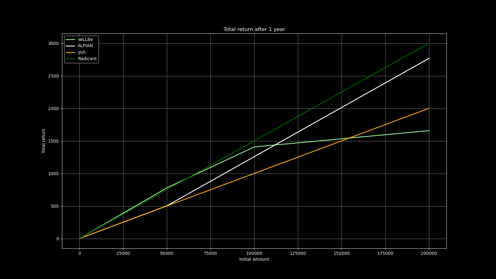

This Python script calculates the Effective Annual Rate (EAR) for different bank accounts and visualizes the total return after one year for a range of initial amounts. The script uses both matplotlib and plotly for visualization.
Currently it outputs some Neobanks with great offers to the Swiss Public.

## Code Overview

The script is divided into several functions:

- `calculate_ear(i, n, t=1)`: Calculates the EAR given an interest rate `i`, number of compounding periods `n`, and time `t`.
- `calculate_return(amount, ear_tiers)`: Calculates the total return for a given amount and a list of EAR tiers.
- `calculate_returns_for_all_amounts(initial_amounts, ear_tiers)`: Calculates the total returns for a list of initial amounts and a list of EAR tiers.
- `calculate_ear_vectorized(i, n, t=1)`: Vectorized version of `calculate_ear` for arrays.
- `calculate_return_vectorized(amounts, ear_tiers)`: Vectorized calculation of returns for a range of amounts.
- `create_and_show_figure(initial_amounts, accounts, colors)`: Creates a matplotlib figure and shows it.
- `create_and_show_figure_plotly(initial_amounts, accounts, colors)`: Creates a plotly figure and saves it as an HTML file.

The script then defines a range of initial amounts and EAR tiers for each account, and uses the above functions to calculate the total return for each account and visualize the results.

## Usage

To use this script, you need to have numpy, matplotlib, and plotly installed in your Python environment. You can then run the script in a Jupyter notebook or any Python environment.

## Customization

You can customize the script by modifying the `accounts` dictionary to add or remove accounts and their EAR tiers, and the `colors` dictionary to change the colors used in the plots.

## Output

The script outputs a matplotlib figure and a plotly figure, both showing the total return after one year for each account for a range of initial amounts. The matplotlib figure is saved as 'total_return.png', and the plotly figure is saved as 'total_return.html'.

For December 2023 the following figure is valid:

So wiLLbe is the best until you reach around 62k, then you can use Radicant for up to 250k, and after that Alpian offers 1.5% up to 1 million... You can also go to the interactive [Plotly Plot](https://d33pk3rn3l.github.io/Swiss-Interest-Calculator/total_return.html) to check out everything.

## License

This project is licensed under The Unlicense.
